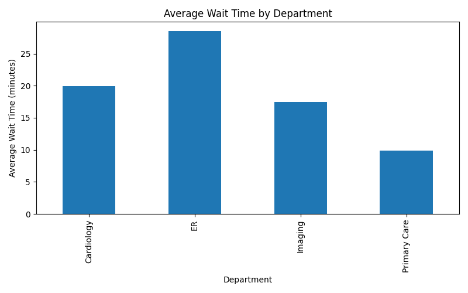
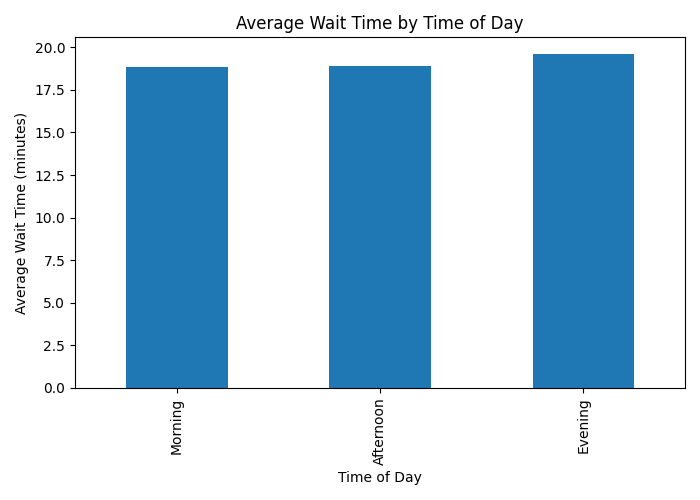
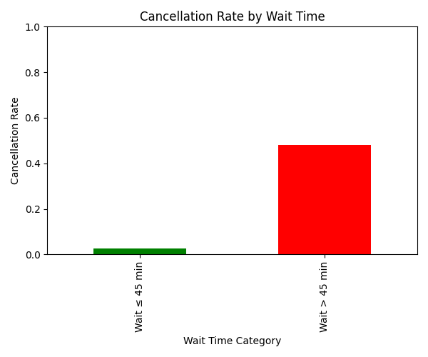

# Healthcare Operations: Appointment Wait Time Analysis

## Overview

This project analyzes appointment wait times across hospital departments to identify operational bottlenecks and opportunities for improvement.

Using a realistic synthetic dataset, the analysis evaluates how staffing levels, time of day, and wait duration influence delays and appointment cancellations.

## Objectives

- Identify departments with the longest average wait times
- Examine how wait times vary by time of day
- Analyze the relationship between long waits and appointment cancellations
- Provide operational recommendations without increasing costs

## Dataset

Type: Synthetic (realistic, non-sensitive)  
Size: 6,000 appointment records

Key Features:
- Department
- Scheduled hour
- Staff on shift
- Wait time (minutes)
- Time block (Morning / Afternoon / Evening)
- Appointment status (Completed / Cancelled)

The dataset was intentionally generated to simulate realistic hospital operations while avoiding privacy or compliance risks.

## Methodology

- Data generation and analysis performed in Python
- Libraries used: pandas, numpy, matplotlib
- Validation checks ensured:
  - Realistic value ranges
  - Higher wait times in emergency services
  - Increased cancellation likelihood for long waits

## Key Findings

- Emergency services experience the highest average wait times
- Afternoon periods show increased congestion
- Higher staffing levels are associated with lower wait times
- Appointments with waits longer than 45 minutes are significantly more likely to be cancelled

## Visualizations

### Average Wait Time by Department


### Average Wait Time by Time of Day


### Cancellation Rate by Wait Length


## Recommendations

- Reallocate staff toward afternoon peak hours
- Prioritize staffing adjustments in emergency services
- Introduce scheduling buffers to reduce long waits
- Optimize existing resources without increasing operational costs

## Project Structure

```
hospital-wait-time-analysis/
│
├── main.py
├── synthetic_hospital_appointments.csv
├── avg_wait_by_department.png
├── avg_wait_by_time_block.png
├── cancellation_rate_by_wait.png
└── README.md
```

## Tools Used

Python  
Pandas  
NumPy  
Matplotlib  

## How to Run

1. Install required libraries:

```
pip install pandas numpy matplotlib
```

2. Run the script:

```
python main.py
```
